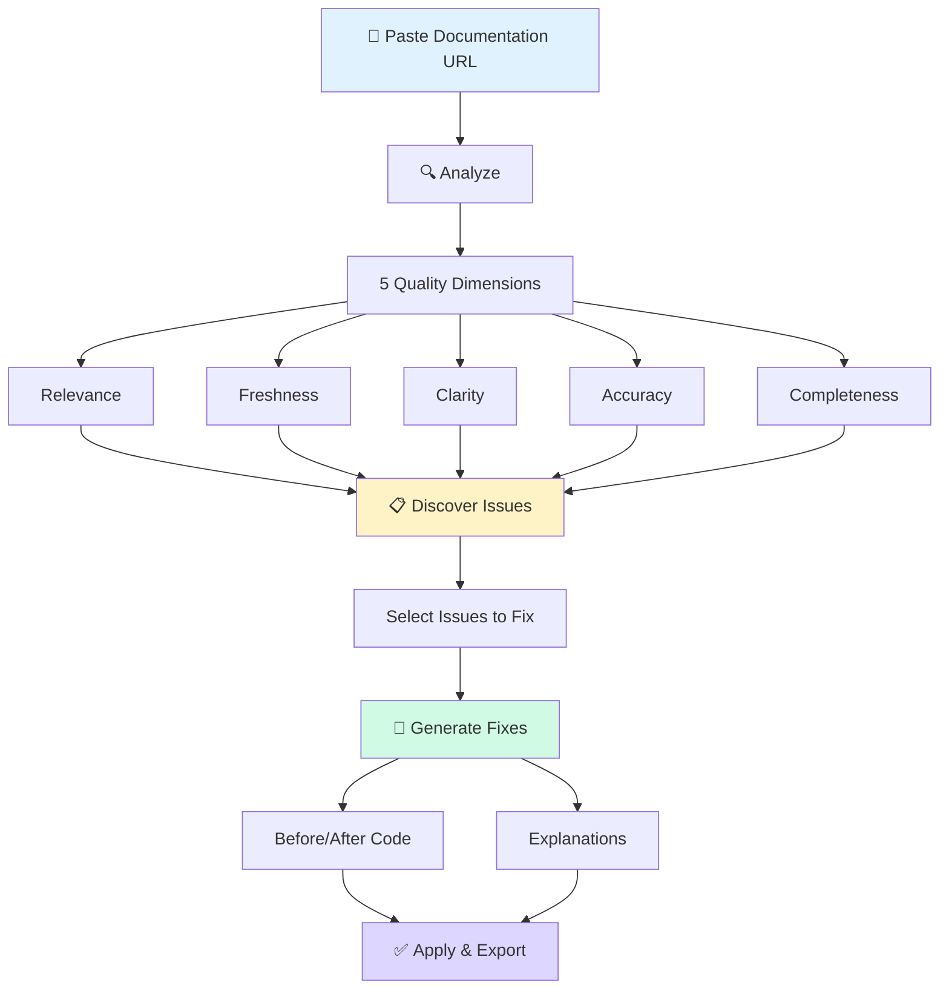
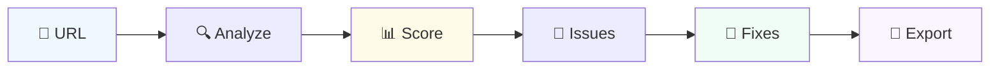
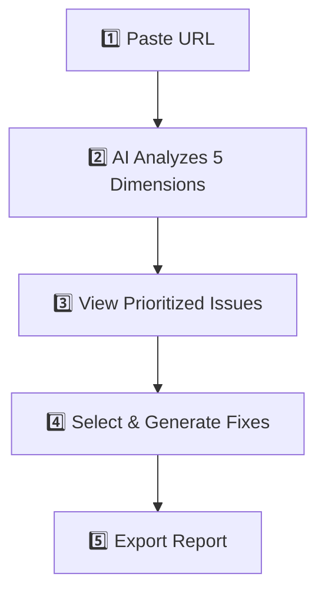
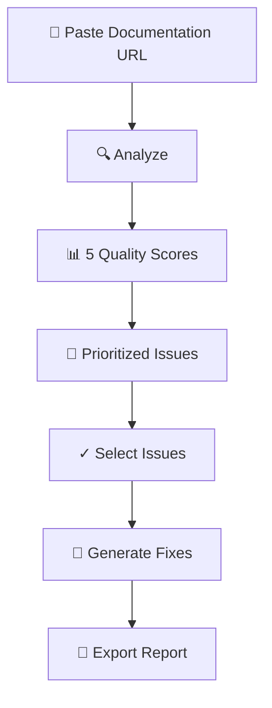

# Website Content Requirements: Google for Startups Cloud Program
## Rev 2 - Added "How It Works" Section

### Google's Feedback
- "Primarily descriptive" - needs visual proof of product
- "Not enough visual information" - needs screenshots/video
- Must "clearly showcase a digital-native business model" - needs product demo

**Goal**: Add missing content sections to existing website. No redesign needed.

---

## CURRENT HOMEPAGE STRUCTURE

```
perseveranceai.com (current)
├── Hero Section ✅
├── See Lensy In Action (video) ✅
├── What Lensy Detects (features) ← REPLACE with "How It Works"
├── Why Lensy (benefits) ✅
├── Become a Design Partner (contact) ✅
└── About page linked ✅
```

---

## NEW SECTION: "HOW IT WORKS"

### Placement

**Replace**: "What Lensy Detects" section  
**Reason**: "How It Works" tells a complete end-to-end story, which is more compelling than listing feature bullets. It shows the mechanism Google wants to see.

### Layout: Two-Column

```
┌─────────────────────────────────────────────────────────────────┐
│                      HOW IT WORKS                                │
├────────────────────────────┬────────────────────────────────────┤
│                            │                                    │
│   STEP-BY-STEP TEXT        │      MERMAID FLOW DIAGRAM          │
│   (Left Column)            │      (Right Column)                │
│                            │                                    │
│   1. Input                 │   ┌─────────┐                      │
│   2. Analyze               │   │  URL    │                      │
│   3. Discover              │   └────┬────┘                      │
│   4. Select                │        ▼                           │
│   5. Generate              │   ┌─────────┐                      │
│   6. Apply                 │   │ Analyze │                      │
│                            │   └────┬────┘                      │
│                            │        ▼                           │
│                            │      ...                           │
│                            │                                    │
└────────────────────────────┴────────────────────────────────────┘
```

### Left Column: Step-by-Step Text

```markdown
## How It Works

### 1. Input
Paste any documentation URL — API references, SDK guides, tutorials.
No setup, no integration required.

### 2. Analyze  
Lensy evaluates your content against five quality dimensions:
Relevance, Freshness, Clarity, Accuracy, and Completeness.

### 3. Discover
See a prioritized list of issues — deprecated code, outdated APIs, 
missing content — with specific line numbers and context.

### 4. Select
Choose which issues to fix. Focus on high-impact problems first.

### 5. Generate
AI generates before/after code fixes with explanations.
No guesswork — see exactly what to change.

### 6. Apply
Export your fixes as a report, or apply them directly.
Share with your team and track improvements.
```

### Right Column: Mermaid Diagram



### Alternative: Simpler Linear Diagram

If the above is too complex, use this cleaner version:



### Alternative: Vertical Flow (Mobile-Friendly)



---

## HTML/CSS IMPLEMENTATION

### Two-Column Layout

```html
<section id="how-it-works" class="how-it-works-section">
  <h2>How It Works</h2>
  
  <div class="two-column-layout">
    <!-- Left Column: Steps -->
    <div class="steps-column">
      <div class="step">
        <span class="step-number">1</span>
        <h3>Input</h3>
        <p>Paste any documentation URL — API references, SDK guides, tutorials. No setup required.</p>
      </div>
      
      <div class="step">
        <span class="step-number">2</span>
        <h3>Analyze</h3>
        <p>AI evaluates content against 5 dimensions: Relevance, Freshness, Clarity, Accuracy, Completeness.</p>
      </div>
      
      <div class="step">
        <span class="step-number">3</span>
        <h3>Discover</h3>
        <p>See prioritized issues with specific line numbers — deprecated code, outdated APIs, content gaps.</p>
      </div>
      
      <div class="step">
        <span class="step-number">4</span>
        <h3>Select</h3>
        <p>Choose which issues to fix. Focus on high-impact problems first.</p>
      </div>
      
      <div class="step">
        <span class="step-number">5</span>
        <h3>Generate</h3>
        <p>AI creates before/after code fixes with clear explanations.</p>
      </div>
      
      <div class="step">
        <span class="step-number">6</span>
        <h3>Apply</h3>
        <p>Export fixes as a report or apply directly. Share with your team.</p>
      </div>
    </div>
    
    <!-- Right Column: Diagram -->
    <div class="diagram-column">
      <div class="mermaid">
        <!-- Mermaid diagram code here -->
      </div>
    </div>
  </div>
</section>
```

### Basic CSS

```css
.how-it-works-section {
  padding: 4rem 2rem;
}

.two-column-layout {
  display: grid;
  grid-template-columns: 1fr 1fr;
  gap: 3rem;
  max-width: 1200px;
  margin: 0 auto;
}

/* Mobile: Stack columns */
@media (max-width: 768px) {
  .two-column-layout {
    grid-template-columns: 1fr;
  }
}

.steps-column {
  display: flex;
  flex-direction: column;
  gap: 1.5rem;
}

.step {
  display: flex;
  flex-direction: column;
  gap: 0.5rem;
}

.step-number {
  display: inline-flex;
  align-items: center;
  justify-content: center;
  width: 28px;
  height: 28px;
  background: #3b82f6;
  color: white;
  border-radius: 50%;
  font-weight: 600;
  font-size: 14px;
}

.step h3 {
  margin: 0;
  font-size: 1.1rem;
}

.step p {
  margin: 0;
  color: #6b7280;
  font-size: 0.95rem;
}

.diagram-column {
  display: flex;
  align-items: center;
  justify-content: center;
  background: #f9fafb;
  border-radius: 12px;
  padding: 2rem;
}
```

---

## MERMAID INTEGRATION OPTIONS

### Option 1: Mermaid.js (Recommended)

Add to your HTML `<head>`:
```html
<script src="https://cdn.jsdelivr.net/npm/mermaid/dist/mermaid.min.js"></script>
<script>mermaid.initialize({ startOnLoad: true });</script>
```

Then in your HTML:
```html
<div class="mermaid">
flowchart TD
    A[Paste URL] --> B[Analyze 5 Dimensions]
    B --> C[View Issues]
    C --> D[Generate Fixes]
    D --> E[Export Report]
</div>
```

### Option 2: Pre-rendered SVG

Generate the diagram at https://mermaid.live/, export as SVG, and embed:
```html

```

### Option 3: CSS/HTML Diagram

Build a simple flow with HTML/CSS if you want full control (no JS dependency).

---

## UPDATED HOMEPAGE STRUCTURE

```
perseveranceai.com (after update)
├── Hero Section ✅
├── See Lensy In Action (video) ✅
├── How It Works (NEW - replaces "What Lensy Detects")
│   ├── Left: 6-step text flow
│   └── Right: Mermaid diagram
├── Why Lensy (benefits) ✅
├── Become a Design Partner (contact) ✅
└── About page linked ✅
```

---

## WHY THIS MATTERS FOR GOOGLE

The "How It Works" section directly addresses Google's feedback:

| Google's Concern | How This Helps |
|------------------|----------------|
| "Primarily descriptive" | Shows concrete mechanism, not just features |
| "Not enough visual information" | Diagram provides visual representation |
| "Showcase digital-native business model" | Demonstrates actual product workflow |

---

## IMPLEMENTATION CHECKLIST

### For "How It Works" Section

- [ ] Create two-column layout (steps + diagram)
- [ ] Write 6-step copy (use text above)
- [ ] Choose diagram approach:
  - [ ] Option A: Mermaid.js (dynamic)
  - [ ] Option B: Pre-rendered SVG (static)
  - [ ] Option C: HTML/CSS diagram (no dependencies)
- [ ] Test on mobile (columns should stack)
- [ ] Replace "What Lensy Detects" section

### Existing Checklist (Already Done ✅)

- [x] Demo video on homepage
- [x] Video fallback image
- [x] Founder section (About page)
- [x] Stage badge ("Prototype • Seeking Design Partners")
- [x] Updated CTA ("Become a Design Partner")

---

## QUICK COPY-PASTE: STEP TEXT

```
1. INPUT
Paste any documentation URL — API references, SDK guides, tutorials. No setup required.

2. ANALYZE
AI evaluates content against 5 quality dimensions: Relevance, Freshness, Clarity, Accuracy, and Completeness.

3. DISCOVER
See a prioritized list of issues with specific line numbers — deprecated code, outdated APIs, content gaps.

4. SELECT
Choose which issues to fix. Focus on high-impact problems first.

5. GENERATE
AI creates before/after code fixes with clear explanations. No guesswork.

6. APPLY
Export fixes as a report or apply directly. Share with your team and track improvements.
```

---

## QUICK COPY-PASTE: MERMAID CODE



---

## AFTER IMPLEMENTATION

Email to Will at Google:

> Hi Will,
> 
> Website updated with additional content:
> - Added "How It Works" section showing the end-to-end analysis flow
> - Visual diagram of the 6-step process (URL → Analyze → Issues → Fixes → Export)
> 
> This complements the demo video and screenshots already on the site.
> 
> Ready for re-review: https://perseveranceai.com
> 
> Thanks,
> Rakesh
